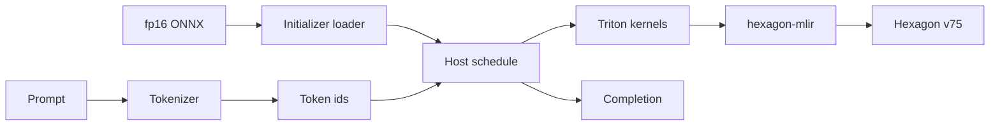
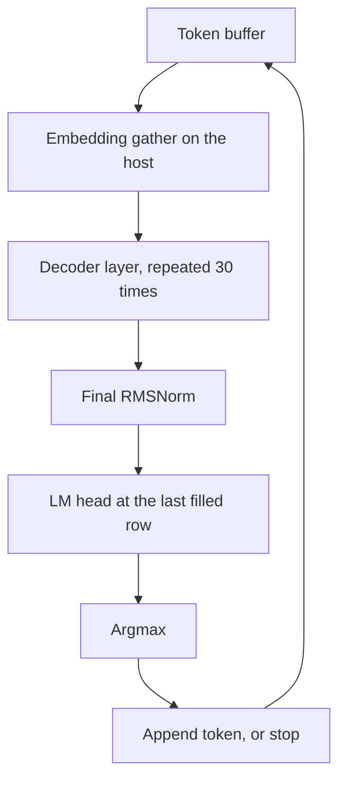
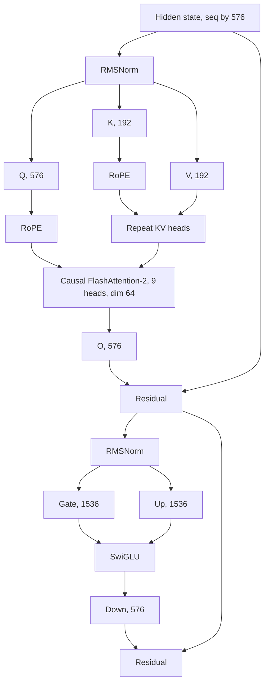

# SmolLM-135M fp16 on Hexagon

## Scope

SmolLM-135M (`HuggingFaceTB/SmolLM-135M`) is a 30-layer Llama model:

| | |
|---|---|
| hidden | 576 |
| intermediate | 1536 |
| query heads | 9 |
| KV heads | 3 (grouped-query, groups of 3) |
| head dim | 64 |
| vocab | 49152, embeddings tied to the LM head |
| norm | RMSNorm, eps 1e-5 |
| activation | SwiGLU (SiLU) |
| positions | RoPE, theta 10000 |
| weights | fp16 ONNX, about 270MB |

The file used here is `onnx-community/SmolLM-135M-ONNX`, path `onnx/model_fp16.onnx`.

That ONNX graph is a **one-token decode** export: `input_ids` plus `past_key_values.{0..29}.{key,value}` and an attention mask whose length is `past + 1`. It is not a graph this compiler can ingest. hexagon-mlir lowers Triton (and Torch-MLIR) to Linalg, then to Hexagon LLVM. There is no ONNX dialect in the pipeline.

The ONNX file is a weight source. Generation is a host loop over static-shape Triton kernels. Numeric checks on a real Hexagon DSP are deferred; the instruction simulator is too slow for the vocabulary matmul.

## Pipeline

`generate.py` reads the fp16 ONNX file and a prompt, then greedy-decodes inside a fixed power-of-two context.



One forward fills a length-`seq` buffer. Positions after the prompt stay at the end-of-text id. Causal attention keeps them from affecting the prefix. The new token is the argmax at the last filled position, then it is written into the next slot and the forward runs again.



Each decoder layer is the Llama block. Grouped-query repeat is host-side: 3 key/value heads become 9. Everything else is a kernel.



Every kernel takes the same lowering path. The host launches one shared object per kernel.


Host code owns the layer loop, the embedding gather from the `[49152, 576]` table, and the grouped-query repeat. The compiler sees only the static kernels.

## Kernels

All compute is fp16 in, fp32 accumulate where a reduction or matmul needs it, fp16 out.

| Op | Kernel | Notes |
|---|---|---|
| residual add | `residual_kernel` | flat vector add |
| RMSNorm | `rms_norm_kernel` | variance in fp32 |
| linear | `linear_tile_kernel` | projections. `y = x @ W` with ONNX layout `[K, N]`. K steps by 64. N is split into power-of-two column tiles |
| LM head | `linear_kernel` | one launch for the last row, `[1, 576] @ [576, 49152]`, tiles of 512 inside the kernel |
| RoPE | `rope_kernel` | Llama half-rotation, cos/sin table built on the host |
| SwiGLU | `swiglu_kernel` | `silu(gate) * up` |
| attention | `causal_attention_kernel` | causal FlashAttention-2 forward: online softmax, fp32 row max/sum, fp16 `tl.dot` |

Attention is launched once per head. The existing Hexagon flash-attention test is a single non-causal head with the whole query block resident in one program. This kernel keeps that structure and adds the causal mask inside the key/value loop. Sequence length has to be a power of two (`tl.arange` / `tl.dot`).

## What this does not do

- It does not compile the ONNX graph itself.
- It does not grow a KV cache. Dynamic sequence length is unsupported, so each decode step replays a fixed-length causal prefill and writes the new token into the next position.
- A full 30-layer simulator prefill is a long series of compile-and-sim launches. `--num-layers` selects a prefix of the stack. The default generation path runs all 30.
- The tied LM head is one matmul launch, `[1, 576] @ [576, 49152]`, taken at the last filled position. On the instruction simulator that launch dominates wall time, so token-level timing is left for a device run.
- int4 / bnb ONNX variants are out of scope. The source checkpoint is bfloat16; this path casts the published fp16 export.

## Files

- `config.py` — SmolLM-135M constants
- `onnx_weights.py` — map ONNX initializers, including unnamed MatMul weights, into layer tensors
- `reference.py` — PyTorch prefill used as the numeric reference
- `kernels.py` — Triton kernels and launch helpers
- `pipeline.py` — layer schedule and greedy decode loop
- `generate.py` — command-line entry point: ONNX file in, generated text out
- `fetch_model.py` — download `model_fp16.onnx`
- `test_reference.py` — weight shapes, and a 1-token compare against ONNX Runtime
- `test_kernels.py` — hexagon-sim checks

## Run

Download once (the checked-in tree does not contain the 270MB model):

```bash
python examples/smollm135m/fetch_model.py
export SMOLLM_ONNX=/home/ubuntu/hexagon-artifacts/models/smollm-135m/model_fp16.onnx
```

CPU reference against ONNX Runtime, from `examples/smollm135m` with the project virtualenv:

```bash
python test_reference.py
```

Simulator, with the same environment used for `test/python/triton/test_vec_add.py` (`RUN_ON_SIM=1`, `HEXAGON_ARCH_VERSION=75`, Hexagon SDK 6.6 and Tools 19 on `PATH`):

```bash
python test_kernels.py residual
python test_kernels.py linear
python test_kernels.py attention
python test_kernels.py layer
```

`layer` runs one full decoder block at sequence length 16 and the real hidden size, on random fp16 weights, and compares it to `reference.py`.

Generate from the ONNX file:

```bash
python generate.py \
    --onnx "$SMOLLM_ONNX" \
    --prompt "The capital of France is" \
    --max-new-tokens 8 \
    --seq-len 16
```

## What was run

On hexagon-sim v75, fp16, against the PyTorch reference:

| Check | max abs error |
|---|---|
| residual, seq 16 × hidden 576 | 0.00391 |
| RMSNorm, same shape | 0.00049 |
| SwiGLU, seq 16 × intermediate 1536 | 0.00781 |
| linear, 16×64×64 and a 576-wide q_proj | ≤ 0.00006 |
| Llama RoPE, 9 heads × seq 16 × dim 64 | 0 |
| causal FlashAttention-2, seq 32 × dim 64 | 0.00002 |
| one full decoder layer, SmolLM widths, seq 16 | 0.00012 |

The fp16 ONNX checkpoint itself was checked on CPU: a one-token prefill through all 30 layers matches ONNX Runtime on the published decode graph (empty KV cache). The top token agrees, and the max logit difference is 0.16. That graph is a decode export, so the length-1 prefill is the case where the two schedules are the same math.

`generate.py` was started on hexagon-sim for the prompt "The capital of France is" at sequence length 16. It compiled and ran the embedding plus the first decoder layer, then entered the vocabulary matmul. That launch was stopped. Measuring tokens per second belongs on a device, where the same shared objects run on the DSP instead of being interpreted.
